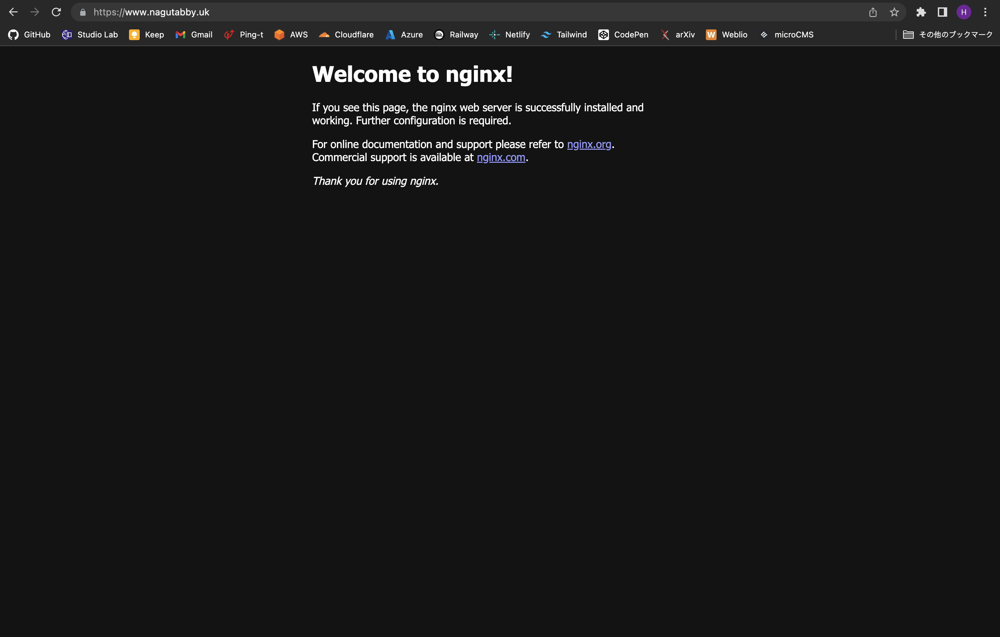

# Cloudflare Tunnel

Cloudflare Tunnelはトンネリングを行うためのサービスです。Cloudflareのエッジサーバと自分のサーバの間にトンネルを作成することで、パブリックIPアドレスを持たないサーバにインターネットから接続できるようになります。

# Cloudflare Tunnelを採用した背景

自宅にRaspberry Piを余らせており、Cloudflare Tunnelを使ってそれをサーバとして運用できないか？と思い、試しに使ってみたらめちゃくちゃ使いやすかったため採用しました。

入学した時から大学のISPのネットワークを利用しているのですが、ICMPやSMTPなどのアウトバウンドトラフィックがファイアウォールでブロックされており、自宅サーバを上手く構築できずにいました。Cloudflare Tunnelがいい感じにやってくれると知り、試してみました。

# Cloudflare Tunnelのいいところ

-   DDNS(Dynamic DNS)や固定パブリックIPアドレスが不要
-   CloudflareのCDNの恩恵を受けられる
-   SSL証明書を自動で発行してくれる
-   IPv6アドレスが割り当てられていないサーバでもIPv6アドレス経由のクライアントと通信できる
-   DDoS攻撃の負荷分散を実施してくれる
-   ARM環境でもトンネルを構築できる

# 検証環境

-   Rasberry Pi 4 model B
-   RAM 4GB
-   ROM 32GB
-   Ubuntu Server 22.10

# 手順

## ドメインを取得

[Cloudflare Registrar](https://www.cloudflare.com/ja-jp/products/registrar/)などのレジストラでドメインを取得します。どのドメインを取得すればいいか分からない方は、一番安いTLD(Top Level Domain)のドメインを1つ用意しましょう。

## 権威DNSサーバをCloudflareのものに変更

Cloudflare TunnelはCloudflareのCDNを利用するため、権威DNSサーバをCloudflareのものに変更する必要があります。

Cloudflare Registrarで取得した場合は、CloudflareのDNSサーバが初めから権威DNSサーバとして使用されますが、それ以外のレジストラで取得した場合はNSレコードで特定のサブドメインをCloudflareのDNSサーバに委任するか、権威DNSサーバをCloudflareに変更しましょう。

## サーバにcloudflaredをインストール

[cloudflared](https://github.com/cloudflare/cloudflared)は、その名の通りcloudflareのデーモン(daemon)で、トンネルを作成するために必要なソフトウェアです。

Raspberry Piで動作しているUbuntuの場合は、`cloudflared-linux-armhf.deb`という名前のパッケージをGitHubからwgetし、aptでインストールします。

```bash
wget https://github.com/cloudflare/cloudflared/releases/download/2023.3.0/cloudflared-linux-armhf.deb
sudo apt install -y ./cloudflared-linux-armhf.deb
```

`cloudflared --version`を実行してインストールできたかどうか確認します。

```bash
ubuntu@ubuntu:~$ cloudflared --version
cloudflared version 2023.3.0 (built 2023-03-02-1000 UTC)
```

## Cloudflareにログイン

まずはCloudflareのアカウントでログインする必要があるため、ログイン用のコマンドを実行します。

```bash
cloudflared tunnel login
```

認証用URLにアクセスするように求められるので、ブラウザでそのURLにアクセスします。

## トンネルを作成

トンネルの名前は自由に決められます。`raspi-tunnel`などの名前にするのがいいでしょう。

```bash
cloudflared tunnel create [トンネル名]
```

トンネルが作成されると、`~/.cloudflared/`というディレクトリが作成され、そのディレクトリ以下にトンネリングに必要なファイルが作成されます。

## cloudflaredの設定ファイルを編集

cloudflaredの設定ファイルは`~/.cloudflared/config.yml`と`/etc/cloudflared/config.yml`です。`~/.cloudflared/config.yml`を編集してそれを`/etc/cloudflared/config.yml`にコピーしているので、実質的にファイルに記載する内容は同じです。`~/.cloudflared/xxxxxxx-xxxx-xxxx-xxxx-xxxxxxxxxxxx.json`という名前のファイルがクレデンシャルです。

そのファイルの.jsonまでの部分がトンネルのIDです。これをコピーし、`~/.cloudflared/config.yml`に記載します。

```yaml
tunnel: xxxxxxx-xxxx-xxxx-xxxx-xxxxxxxxxxxx
credentials-file: /home/[ユーザ名]/.cloudflared/xxxxxxx-xxxx-xxxx-xxxx-xxxxxxxxxxxx.json

ingress:
 - hostname: www.example.com
   service: http://localhost:80
 - service: http_status:404
```

## cloudflaredをsystemdのサービスとしてインストール

先ほど作成した~/.cloudflared/config.ymlを用いて、cloudflaredのユニットファイルを作成します。

```bash
sudo cloudflared --config ~/.cloudflared/config.yml service install
```

## Webサーバをインストール

今回はNGINXをインストールします。

```bash
sudo apt install -y nginx
```

## 公開するサービスのゾーン情報を追加

CloudflareのDNSにレコードを追加します。

```bash
cloudflared tunnel route dns [トンネル名] [FQDN]
```

この記事の例で説明すると、FQDNはwww.example.comになります。

## Webブラウザで公開先のドメインにアクセス

ドメインにアクセスし、公開できていることを確認します。

今回はlocalhostの80番をトンネリングしているため、HTTP(80/tcp)とHTTPS(443/tcp)からアクセスできます。



# Cloudflare AccessでWebブラウザからSSH通信する

## Cloudflare Accessのアプリケーションを作成

まず初めに[Cloudflare Access](https://www.cloudflare.com/ja-jp/products/zero-trust/access/)の設定をします。Cloudflare Accessは、セルフホスト型のアプリやSaaSなどに認証を追加するサービスです。Freeプランで50ユーザまで認証できます。

Self-hostedを選択し、Cloudflare Accessを利用するドメインを登録します。この記事では、例としてssh.example.comというドメインを使うことにします。ドメインの登録の他には、認証ルールであるPolicyの設定も必要です。参考までに、メールで認証する場合は、設定は以下のようになります。

-   Action: Allow
-   Rules:
    -   Include
    -   Selector: Emails, あるいはEmails ending in
    -   Value:
        -   Emailsの場合: 認証に使うメールアドレス
        -   Emails ending inの場合: 認証に使うメールアドレスの@以降
            -   例: Gmailのメールアドレスを許可する場合は@gmail.comを入力

最後に、Additional settingsという項目にあるBrowser renderingをSSHに設定します。

## /etc/cloudflared/config.ymlにSSHの設定を追加

```yaml
tunnel: xxxxxxx-xxxx-xxxx-xxxx-xxxxxxxxxxxx
credentials-file: /home/[ユーザ名]/.cloudflared/xxxxxxx-xxxx-xxxx-xxxx-xxxxxxxxxxxx.json

ingress:
  - hostname: ssh.example.com
    service: ssh://localhost:22
  - hostname: www.example.com
    service: http://localhost:80
  - service: http_status:404
```

## cloudflaredを再起動して/etc/cloudflared/config.ymlの変更を反映させる

```bash
sudo systemctl restart cloudflared
```

## 公開するサービスのゾーン情報を追加

```bash
cloudflared tunnel route dns [トンネル名] [FQDN]
```

この記事の例で説明すると、FQDNはssh.example.comになります。

## Webブラウザで公開先のドメインにアクセス

HTTPの場合と同様に、Cloudflare Tunnelで関連付けたドメインにアクセスします。

Cloudflare Accessで認証の設定をしたため、認証画面が表示されます。

# トラブルシューティング

## Cloudflare Tunnelを使ったSSH通信ができない

```
Unable to reach the origin service. The service may be down or it may not be responding to traffic from cloudflared: net/http: HTTP/1.x transport connection broken: malformed HTTP status code
```

というエラーが発生する場合は、`/etc/cloudflared/config.yml`の設定ミスの可能性があります。

ingressで指定している、`service: ssh://localhost:22`を`service: http://localhost:22`とタイポしてしまうと上記のエラーが発生します。

httpをsshに変更してcloudflaredを再起動すると直ります。
