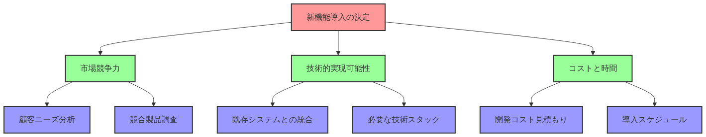

# 初めに

私はシステム開発において新しい方法を提案したり相談したりするときに言語化が苦手です。特にエンジニア以外と話すときは専門用語を避けなければならないので考えるべきことが多く、言語化をする際にとても混乱してしまいます。そのような言語化が苦手なエンジニアがどのように行動すべきかを考えます。

# 説明をパターン化する

話し合いにおいては論理的な説明が重要です。論理構造に基づいて説明の流れをパターン化すれば、説明がより論理的になります。有名な説明手法としてはPREP法があります。

PREP法はPoint (要点) , Reason (理由) , Example (例) , Point (要点の強調) からなり、多くの場面で

活用できます。

PREP法を用いた場合の話の流れを、場面ごとに考えてみましょう。

## 活用場面

### 新しい技術を提案するとき

-   Point: 新しい技術の採用を提案
-   Reason: 開発速度の向上や保守性の改善ができる
-   Example: これまでの成功事例を紹介
-   Point: 新しい技術の採用により、開発効率が向上することを主張

### バグを報告するとき

-   Point: 特定の状況でエラーが発生することを指摘
-   Reason: バリデーションが不十分なため、不適切なデータが送られてしまう
-   Example: 不適切な入力値によりエラーが発生することを示す
-   Point: バリデーションの改善が必要であることを主張

### コードレビューをするとき

-   Point: 修正が必要なプログラムを指摘
-   Reason: コードの可読性が低く、それにより保守性が低下する
-   Example: 修正すべきコードを具体的に指摘し、改善案を示す
-   Point: コードの修正により、サービスの品質が向上することを主張

# 言語化フレームワークを活用する

言語化能力を高めるために必要なことは意外と少ないです。そもそも言語化とは、自分が持っている思考、感覚、経験、知識などの情報を、他者に理解してもらいやすい形に変換することです。要するに、プログラムの関数のようなものを用意し、それを使って自分が持っている情報 (=入力) を汎用的かつ分かりやすい情報 (=出力) に変換することで言語化できます。

言語化の難しいところは、情報を伝えたい相手によって言語化のレベルが異なるため、言語化のための関数 (言語化関数) をたくさん作らなければならない点です。それならば、「言語化関数を効率的に生成できるフレームワーク (言語化フレームワーク) があればいい」ということになります。このフレームワークで利用される仕組みを理解し、使いこなすことが言語化において重要です。具体的な仕組みとしてはMECEやピラミッド構造があります。

## 言語化のための仕組み

### MECE

MECE (ミーシー) は、Mutually Exclusive, Collectively Exhaustiveの略で、日本語では「相互排他的で全体網羅的」という意味になります。もう少し分かりやすいように意訳すると、MECEとは「重複がなく、漏れがない」という意味です。問題や状況を分析する際に、重複がなく、かつ漏れがないようにそれらをカテゴリー化することを指します。

エンジニアが理解しやすいようにオブジェクト思考に例えるならば、Mutually Exclusiveは「特化」であり、Collectively Exhaustiveは「汎化」であると捉えられます。

ECサイトの機能を提案する場面で、MECEに基づいた図を示してみましょう。

このように問題を体系的に分析することで、以下の利点が得られます。

-   分析の重複や漏れを防ぎ、問題解決を効率化する
-   複雑な問題を構造化して関係者に伝えられる
-   全ての可能性を考慮しながら重複を避けることで、バランスが取れた意思決定ができる

### ピラミッド構造

ピラミッド構造は3つの階層で構成され、それぞれの階層は以下の役割を持ちます。

-   最上位の階層: 最も重要な情報や結論を示す
-   真ん中の階層: それを支持する論点を示す
-   最下位の階層: 詳細な情報や具体例を示す

サービスへの新機能導入を提案する場面で、ピラミッド構造に基づいた図を示してみましょう。

このように情報を整理することで、以下の利点が得られます。

-   重要な情報を最初に提示することで聞き手や読み手の注意を引き、自分の主張を確実に相手に伝えられる
-   上位の概念から下位の詳細に進むことで話の流れが論理的になり、理解しやすくなる
-   時間が限られている場合は上位の情報だけを伝え、より詳細な説明が必要な場合は上位の情報から下位の情報までを伝えられるため、話の柔軟性が高い

# 技術要素から事業的価値に話を展開する

一般的なソフトウェア開発では、エンジニアは機能要件や非機能要件を分析し、技術的な解決策を設計します。この際に、関心事が事業から技術に変化します。そのため、その後の議論でエンジニアが自分の考えを述べようとしても、その考えは技術的関心に基づいたものであるため、エンジニア以外に上手く説明できません。言語化能力を高めるためには、この後に行う関係者へのフィードバックが重要です。すなわち、関心事を技術から事業に変化させる必要があります。

これを踏まえて、技術要素を事業的価値に結びつける方法を段階的に示すと以下のようになります。

1.  具体的な技術要素の選択
2.  技術的な利点と欠点の調査
3.  ユーザー体験への影響の評価
4.  ビジネス指標への影響の考察
5.  事業的価値と課題
6.  最終的な事業判断

具体的な例で考えてみましょう。

## 具体例

### マイクロサービスアーキテクチャの採用

-   技術要素: モノリシックからマイクロサービスへの移行
-   技術的な利点と欠点
    -   利点
        -   サービスごとに独立したデプロイができる
        -   サービスごとにスケーリングできる
        -   サービスごとに異なる技術を採用できる
    -   欠点
        -   システム全体がより複雑になる
        -   サービス間の通信のオーバーヘッドが大きくなる
        -   サービス間のトランザクションの管理が難しくなる
-   ユーザー体験への影響
    -   良い点
        -   新機能をより早くリリースできる
        -   特定の機能のパフォーマンスが向上する
    -   悪い点
        -   アーキテクチャの移行期間中にサービスが中断するかもしれない
        -   機能間のデータの整合性が確保されるまでに時間がかかる
-   ビジネス指標への影響
    -   良い点
        -   新機能をリリースするまでの時間 (Time-to-Market)が30%削減される
        -   ユーザーエンゲージメントが向上し、DAUが15%増加する
    -   悪い点
        -   開発・運用コストが20%増加する
        -   アーキテクチャを移行してから数ヶ月はバグ発生率が上昇する
-   事業的価値と課題
    -   価値
        -   市場変化に迅速に対応できるようになり、競争力が向上する
        -   長期的にはサービスの拡張性と保守性が向上する
    -   課題
        -   アーキテクチャの移行期間中のリスク管理
        -   開発チームの技術力の向上と組織体制の整備

### 機械学習モデルの導入

-   技術要素: 商品推奨システムへの機械学習モデルの導入
-   技術的な利点と欠点
    -   利点
        -   よりパーソナライズされた推奨ができる
        -   ユーザーの行動の変化に適応できる
        -   大量のデータを効率的に処理できる
    -   欠点
        -   モデルの学習と更新に計算リソースが必要
        -   予測の説明可能性が低下する
        -   推奨システムの精度がデータの品質に依存する
-   ユーザー体験への影響
    -   良い点
        -   より関連性が高い商品を推奨できる
        -   ユーザーに新しい興味を持たせられる
        -   よりパーソナライズされることによって満足度が向上する
    -   悪い点
        -   初めは推奨精度が不安定
        -   プライバシーに関する懸念を招くかもしれない
-   ビジネス指標への影響
    -   良い点
        -   コンバージョン率が平均15%増加
        -   注文金額が平均20%増加
        -   ユーザーの滞在時間 (セッション時間) が平均25%増加
    -   悪い点
        -   システムの運用コストが30%増加
        -   データの収集と管理が複雑になる
        -   モデルを更新する際に一時的にサービスが中断するかもしれない
-   事業的価値と課題
    -   価値
        -   顧客満足度の向上
        -   より新しい技術を採用することによる市場での差別化
        -   長期的な収益性の改善
    -   課題
        -   初期投資と継続的な運用コストの管理
        -   データプライバシーとセキュリティの確保
        -   開発チームの技術力の向上と組織体制の整備
