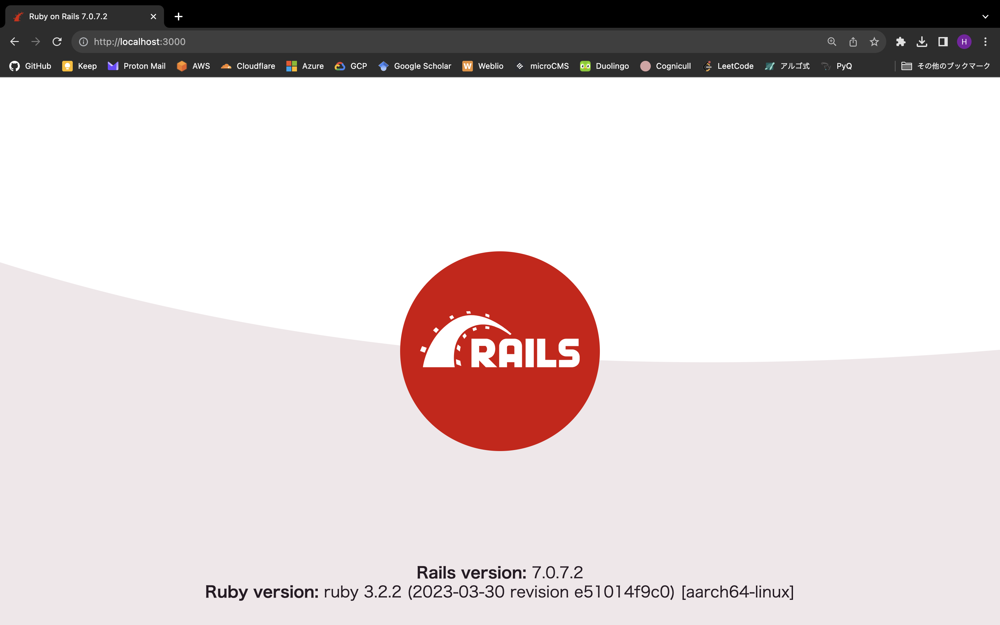
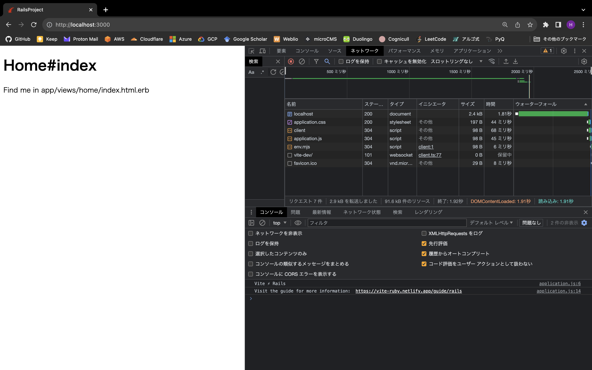
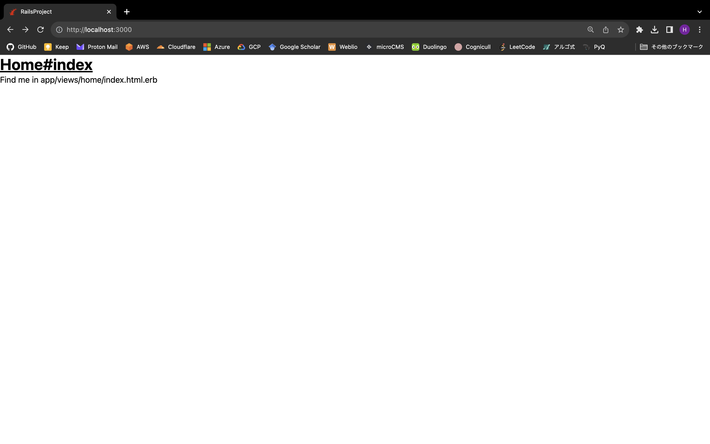
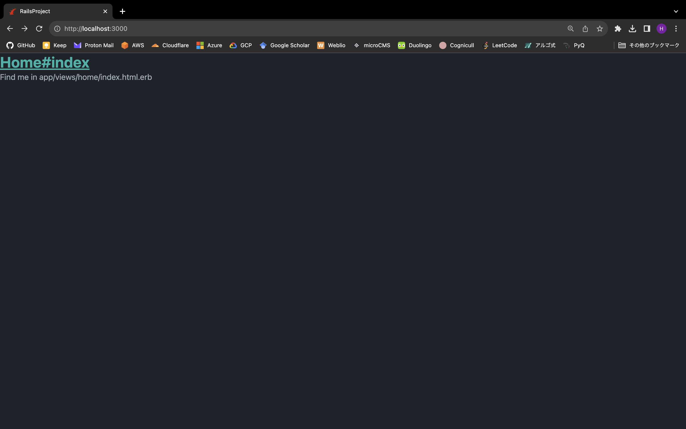

# このアプリの構成

| ビルドツール | Vite |
| --- | --- |
| データベース | PostgreSQL |
| CSSフレームワーク | Tailwind CSS |
| UIライブラリ | daisyUI |
| 仮想環境 | Docker |
| Node.jsのパッケージマネージャー | pnpm |

# プロジェクトの準備

## Dockerのインストール

[Dockerの公式サイト](https://www.docker.com/)からDocker Desktopをダウンロードしてインストールします。

## プロジェクトディレクトリの作成

```bash
mkdir ~/rails-project
cd ~/rails-project
```

## Dockerfileの作成

Railsのイメージをビルドするために`Dockerfile`を作ります。

```dockerfile
FROM ruby:3.2.2

RUN apt-get update
RUN curl -sL http s://deb.nodesource.com/setup_18.x | bash -
RUN apt-get install -y nodejs npm
RUN npm install -g pnpm

ENV PROJECT_DIR /root/rails-project

RUN mkdir $PROJECT_DIR
WORKDIR $PROJECT_DIR

COPY Gemfile $PROJECT_DIR/Gemfile
COPY Gemfile.lock $PROJECT_DIR/Gemfile.lock

ENV BUNDLER_VERSION 2.4.19

RUN gem update --system
RUN gem install bundler -v $BUNDLER_VERSION
RUN bundle
RUN bundle update --source bundler --local

COPY . $PROJECT_DIR

EXPOSE 3000
```

## compose.yamlの作成

PostgreSQLとRailsのコンテナを構築するために`compose.yaml`を作ります。

```yaml
services:
  web:
    image: rails:latest
    build: .
    volumes:
      - .:/root/rails-project
    command: bash -c "rm -f tmp/pids/server.pid && rails s -b 0.0.0.0"
    environment:
      POSTGRES_DEFAULT_USER: postgres
      POSTGRES_DEFAULT_PASSWORD: password
    ports:
      - "3000:3000"
    depends_on:
      - db

  db:
    image: postgres:latest
    volumes:
      - postgres-volume:/var/lib/postgresql/data
    environment:
      POSTGRES_USER: postgres
      POSTGRES_PASSWORD: password

volumes:
  postgres-volume:
```

## GemfileとGemfile.lockの作成

`Gemfile`を作り、以下の内容を記述します。

```
source "https://rubygems.org"

gem "rails"
```

空の`Gemfile.lock`も作っておきます。

## Railsのイメージの作成

```bash
docker compose build
```

## プロジェクトの作成

```bash
docker compose run web rails new . --minimal --skip-asset-pipeline -d postgresql --force
```

-   \--minimal: Railsの追加機能であるAction Cable, Action Mailbox, Action Textをセットアップしない
-   \--skip-asset-pipeline: アセットパイプラインをセットアップしない
-   \-d: データベースを指定する
-   \--force: ファイルを上書きする

`Gemfile.lock`が更新されたので、改めてRailsのイメージをビルドします。

```bash
docker compose build
```

## データベースと通信できるようにする

`config/database.yml` のdefaultセクションにhost, username, passwordを追加します。

```yaml
default: &default
  adapter: postgresql
  host: db
  username: <%= ENV["POSTGRES_DEFAULT_USER"] %>
  password: <%= ENV["POSTGRES_DEFAULT_PASSWORD"] %>
  encoding: unicode
  # For details on connection pooling, see Rails configuration guide
  # https://guides.rubyonrails.org/configuring.html#database-pooling
  pool: <%= ENV.fetch("RAILS_MAX_THREADS") { 5 } %>

...
```

データベースを作成してマイグレーションをします。

```bash
docker compose run web rails db:create db:migrate
```

デフォルトのページを表示してみましょう。以下のコマンドを実行して、[http://localhost:3000](http://localhost:3000)にアクセスします。

```bash
docker compose up
```



## Makefileの作成

Docker Composeのコマンドは長いので、エイリアスを設定するために`Makefile`を作ります。

```makefile
# イメージをビルドする
.PHONY: build
build:
	docker compose build

# イメージをビルドしてコンテナをフォアグラウンドで実行する
.PHONY: up
up:
	docker compose up --build --remove-orphans || true

# コンテナを停止する
.PHONY: stop
stop:
	docker compose stop

# コンテナを停止して削除する
.PHONY: down
down:
	docker compose down --remove-orphans

# バックグラウンドでコンテナを実行し、webコンテナに入る
.PHONY: exec-web
exec-web:
	docker compose up --build --remove-orphans -d
	docker compose exec web bash

# バックグラウンドでコンテナを実行し、dbコンテナに入る
.PHONY: exec-db
exec-db:
	docker compose up --build --remove-orphans -d
	docker compose exec db bash

# rails db:createを実行する
.PHONY: create
create:
	docker compose run web rails db:create

# rails db:migrateを実行する
.PHONY: migrate
migrate:
	docker compose run web rails db:migrate

# rails db:seedを実行する
.PHONY: seed
seed:
	docker compose run web rails db:seed

# rails db:purgeを実行する
.PHONY: purge
purge:
	docker compose run web rails db:purge

# rails db:dropを実行する
.PHONY: drop
drop:
	docker compose run web rails db:drop
```

## GNU Makeのインストール

Makefileを扱うにはGNU Makeが必要です。UbuntuとMacOSにおけるインストールコマンドを示します。

### Ubuntu

```bash
sudo apt install -y build-essential
```

### MacOS

```bash
brew install make
echo 'export PATH="$(brew --prefix)/opt/make/libexec/gnubin:$PATH"' >> ~/.zshrc
source ~/.zshrc
```

# Viteのインストール

package.jsonを作ります。

```json
{
  "devDependencies": {
  }
}
```

空の`pnpm-lock.yaml`も作っておきます。

`.pnpm-store`を`.gitignore`に追加します。

```
# See https://help.github.com/articles/ignoring-files for more about ignoring files.
#
# If you find yourself ignoring temporary files generated by your text editor
# or operating system, you probably want to add a global ignore instead:
#   git config --global core.excludesfile '~/.gitignore_global'

# Ignore bundler config.
/.bundle

# Ignore all logfiles and tempfiles.
/log/*
/tmp/*
!/log/.keep
!/tmp/.keep

# Ignore pidfiles, but keep the directory.
/tmp/pids/*
!/tmp/pids/
!/tmp/pids/.keep


/public/assets

# Ignore master key for decrypting credentials and more.
/config/master.key

# Vite Ruby
/public/vite*
node_modules
# Vite uses dotenv and suggests to ignore local-only env files. See
# https://vitejs.dev/guide/env-and-mode.html#env-files
*.local

.pnpm-store
```

以下のコマンドでViteをインストールします。

```bash
make exec-web

bundle add vite_rails
bundle exec vite install

exit
```

`bin/dev`を作り、以下の内容を記述します。

```bash
#!/usr/bin/env sh

if ! gem list foreman -i --silent; then
  echo "Installing foreman..."
  gem install foreman
fi

exec foreman start -f Procfile.dev "$@"
```

`bin/dev`に実行権限を付与します。

```bash
sudo chmod u+x bin/dev
```

`Procfile.dev`を変更して、ホストOSからコンテナの3000番ポートにアクセスできるようにします。

```
vite: bin/vite dev
web: bin/rails s -p 3000 -b 0.0.0.0
```

`config/vite.json`のdevelopmentセクションにhostセクションを追加して、ホストOSからコンテナの3036番ポートにアクセスできるようにします。

```json
{
  "all": {
    "sourceCodeDir": "app/frontend",
    "watchAdditionalPaths": []
  },
  "development": {
    "autoBuild": true,
    "publicOutputDir": "vite-dev",
    "host": "0.0.0.0",
    "port": 3036
  },
  "test": {
    "autoBuild": true,
    "publicOutputDir": "vite-test",
    "port": 3037
  }
}
```

`Dockerfile`にEXPOSEセクションを追加して、ホストOSからコンテナの3036番ポートにアクセスできるようにします。

```dockerfile
FROM ruby:3.2.2

RUN apt-get update
RUN curl -sL http s://deb.nodesource.com/setup_18.x | bash -
RUN apt-get install -y nodejs npm
RUN npm install -g pnpm

ENV PROJECT_DIR /root/rails-project

RUN mkdir $PROJECT_DIR
WORKDIR $PROJECT_DIR

COPY Gemfile $PROJECT_DIR/Gemfile
COPY Gemfile.lock $PROJECT_DIR/Gemfile.lock

ENV BUNDLER_VERSION 2.4.19

RUN gem update --system
RUN gem install bundler -v $BUNDLER_VERSION
RUN bundle
RUN bundle update --source bundler --local

COPY . $PROJECT_DIR

EXPOSE 3000
EXPOSE 3036
```

`compose.yaml`を変更して、webコンテナの起動時にbin/devを実行するようにします。また、ホストOSの3036番ポートからwebコンテナの3036番ポートにアクセスするようにします。

```yaml
services:
  web:
    image: rails:latest
    build: .
    volumes:
      - .:/root/rails-project
    command: bash -c "rm -f tmp/pids/server.pid && bin/dev"
    environment:
      POSTGRES_DEFAULT_USER: postgres
      POSTGRES_DEFAULT_PASSWORD: password
    ports:
      - "3000:3000"
      - "3036:3036"
    depends_on:
      - db

  db:
    image: postgres:latest
    volumes:
      - postgres-volume:/var/lib/postgresql/data
    environment:
      POSTGRES_USER: postgres
      POSTGRES_PASSWORD: password

volumes:
  postgres-volume:
```

# homeコントローラーの作成

indexアクションを持つhomeコントローラーを作ります。

```bash
make exec-web

rails g controller home index

exit
```

`config/routes.rb`を変更して、rootにアクセスした際にhome#indexのビューが表示されるようにします。

```ruby
Rails.application.routes.draw do
  root "home#index"
  # Define your application routes per the DSL in https://guides.rubyonrails.org/routing.html

  # Defines the root path route ("/")
  # root "articles#index"
end
```

`app/assets/stylesheets`を削除し、`app/frontend/entrypoints/application.css`を作ります。

`app/views/layouts/application.html.erb`の`stylesheet_link_tag`を`vite_stylesheet_tag`に置き換えます。

```erb
<!DOCTYPE html>
<html>
  <head>
    <title>RailsProject</title>
    <meta name="viewport" content="width=device-width,initial-scale=1">
    <%= csrf_meta_tags %>
    <%= csp_meta_tag %>

    <%= vite_stylesheet_tag 'application' %>
    <%= vite_client_tag %>
    <%= vite_javascript_tag 'application' %>
    <!--
      If using a TypeScript entrypoint file:
        vite_typescript_tag 'application'

      If using a .jsx or .tsx entrypoint, add the extension:
        vite_javascript_tag 'application.jsx'

      Visit the guide for more information: https://vite-ruby.netlify.app/guide/rails
    -->

  </head>

  <body>
    <%= yield %>
  </body>
</html>
```

`make up`を実行してから、[http://localhost:3000](http://localhost:3000)にアクセスすると、コンソールに`Vite ⚡️ Rails`と表示されます。



# config/routes.rbとerbファイルに対してHMRを有効にする

HMR用のプラグインをインストールします。

```bash
make exec-web

pnpm add -D vite-plugin-full-reload

exit
```

`vite.config.ts`に`vite-plugin-full-reload`を追加します。

```typescript
import { defineConfig } from 'vite'
import RubyPlugin from 'vite-plugin-ruby'
import FullReload from 'vite-plugin-full-reload'

export default defineConfig({
  plugins: [
    RubyPlugin(),
    FullReload(['config/routes.rb', 'app/views/**/*'], { delay: 100 }),
  ],
})
```

`make up`を実行してから`app/views/home/index.html.erb`を変更してみましょう。HMRが動作していることを確認できます。


# Tailwindのインストール

```bash
make exec-web

pnpm add -D tailwindcss postcss autoprefixer
pnpm tailwindcss init -p

exit
```

`tailwind.config.js`を変更して、Tailwindがコンパイルされるようにします。

```javascript
/** @type {import('tailwindcss').Config} */
module.exports = {
  content: [
    './app/views/**/*.html.erb',
    './app/frontend/**/*.{js,ts,jsx,tsx,vue,svelte}',
  ],
  theme: {
    extend: {},
  },
  plugins: [],
}
```

`app/frontend/entrypoints/application.css`にTailwindを追加します。

```css
@import "tailwindcss/base";
@import "tailwindcss/components";
@import "tailwindcss/utilities";
```

`app/views/home/index.html.erb`にTailwindのクラスを追加して動作を確認します。

```erb
<h1 class="text-3xl font-bold underline">Home#index</h1>
<p>Find me in app/views/home/index.html.erb</p>
```



# daisyUIのインストール

```bash
make exec-web

pnpm add -D daisyui

exit
```

daisyUIを`tailwind.config.js`に追加します。

```javascript
/** @type {import('tailwindcss').Config} */
module.exports = {
  content: [
    './app/views/**/*.html.erb',
    './app/frontend/**/*.{js,ts,jsx,tsx,vue,svelte}',
  ],
  theme: {
    extend: {},
  },
  plugins: [require("daisyui")],
}
```

`app/views/home/index.html.erb`にdaisyUIのクラスを追加して動作を確認します。

```erb
<h1 class="text-3xl font-bold underline text-accent">Home#index</h1>
<p>Find me in app/views/home/index.html.erb</p>
```


