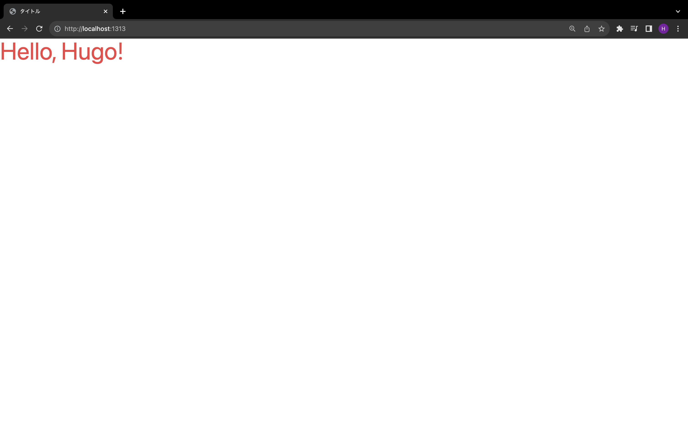

HugoにTailwind CSS 3をインストールしてみます。

# Hugoプロジェクトの作成

```bash
hugo new site hugo-tailwind-css-3-sample
cd hugo-tailwind-css-3-sample
git init
```

# Tailwindのインストール

pnpmでTailwindをインストールします。TailwindはPostCSSのプラグインなので、PostCSSのインストールも必要です。

```bash
pnpm init
pnpm add -D autoprefixer postcss postcss-cli tailwindcss
```

`.gitignore`を作成し、そのファイルに`node_modules`を追記します。

これにより`node_modules`がGitの管理対象から除外されます。

```
/node_modules
```

`tailwind.config.js`と`postcss.config.js`を作成します。

```bash
pnpm tailwind init -p
```

# Cache bustersの設定

Hugo 0.112でTailwind CSS 3がサポートされました。Hugoは、HTMLをビルドするタイミングで`hugo_stats.json`に自動的にTailwindのクラスを追記します。そして、この`hugo_stats.json`の内容が変更されるたびに、CSSファイルをビルドし直します。

`hugo_stats.json`の内容に応じてTailwindのコードを生成させるために、`tailwind.config.js`を変更します。

```javascript
/** @type {import('tailwindcss').Config} */
module.exports = {
  content: [
    "./hugo_stats.json",
  ],
  theme: {
    extend: {},
  },
  plugins: []
}
```

hugo.tomlにCache bustersの設定を追加します。Cache bustersはその名の通り、キャッシュを削除するための設定オプションです。

```toml
baseURL = 'https://example.org/'
defaultContentLanguage = 'ja'
languageCode = 'ja'
title = 'タイトル'

[module]
[[module.mounts]]
source = "assets"
target = "assets"
[[module.mounts]]
source = "hugo_stats.json"
target = "assets/watching/hugo_stats.json"

[build]
[build.buildStats]
enable = true
[[build.cachebusters]]
source = "assets/watching/hugo_stats\\.json"
target = "style\\.scss"
```

Hugo 0.112から0.114までは`writeStats = true`というオプションを指定していましたが、Hugo 0.115から`build.buildStats`に`enable = true`を記述する形式に置き換えられました。`writeStats`は現在非推奨のオプションであり、将来的に廃止される予定です。

`hugo_stats.json`についても`node_modules`と同様にGitの管理対象から除外しておきましょう。

```
/node_modules
/hugo_stats.json
```

続いて`assets`ディレクトリに`css`ディレクトリを作成し、その中に`style.scss`を作成します。

```scss
@tailwind base;
@tailwind components;
@tailwind utilities;
```

# レイアウトの作成

`layouts`ディレクトリに`_default`ディレクトリを作成し、その中に`baseof.html`を作成します。

```html
<!DOCTYPE html>
<html lang="{{ with .Site.LanguageCode }}{{ . }}{{ end }}">
  <head>
    <meta charset="utf-8">
    <meta name="viewport" content="width=device-width, initial-scale=1.0">
    <title>{{ block "title" . }}{{ end }}</title>
    {{ $style := resources.Get "css/style.scss" |  toCSS  | resources.PostCSS }}
    {{ if hugo.IsProduction }}
      {{ $style = $style |  minify  | fingerprint | resources.PostProcess }}
    {{ end }}
    <link href="{{ $style.RelPermalink }}" rel="stylesheet" />
  </head>
  <body>
    <main>
      {{ block "main" . }}{{ end }}
    </main>
  </body>
</html>
```

同じく`layouts/_default`ディレクトリに`index.html`を作成します。

```html
{{ define "title" }}
{{- .Site.Title -}}
{{ end }}
{{ define "main" }}
<div class="text-5xl text-red-500">
  {{ .Content }}
</div>
{{ end }}
```

# コンテンツの作成

ホームに表示するコンテンツを作成するために、マークダウンファイルを作成します。

```bash
hugo new content/_index.md
```

`content/_index.md`を開いて`Hello, Hugo!`という文字列を追記しましょう。追記したら、フロントマターの`draft`を`false`に変更してコンテンツが公開されるようにします。

```markdown
+++
title = ''
date = 2023-10-09T01:18:58+09:00
draft = false
+++

Hello, Hugo!
```

# Tailwindの動作確認

Hugoのサーバーを起動して、Tailwind CSS 3が動作することを確認します。

```bash
hugo serve
```

`http://localhost:1313`にアクセスすると、赤く大きい文字で`Hello, Hugo!`と表示されます。



# 参考

-   [https://gohugo.io/getting-started/configuration/#configure-cache-busters](https://gohugo.io/getting-started/configuration/#configure-cache-busters)