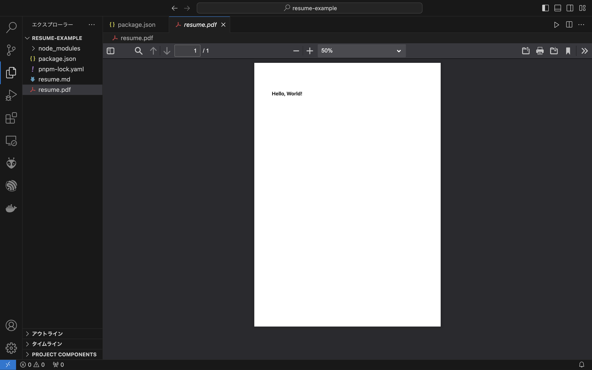
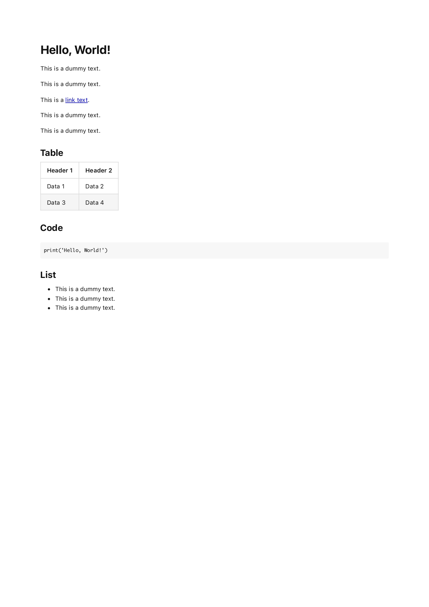
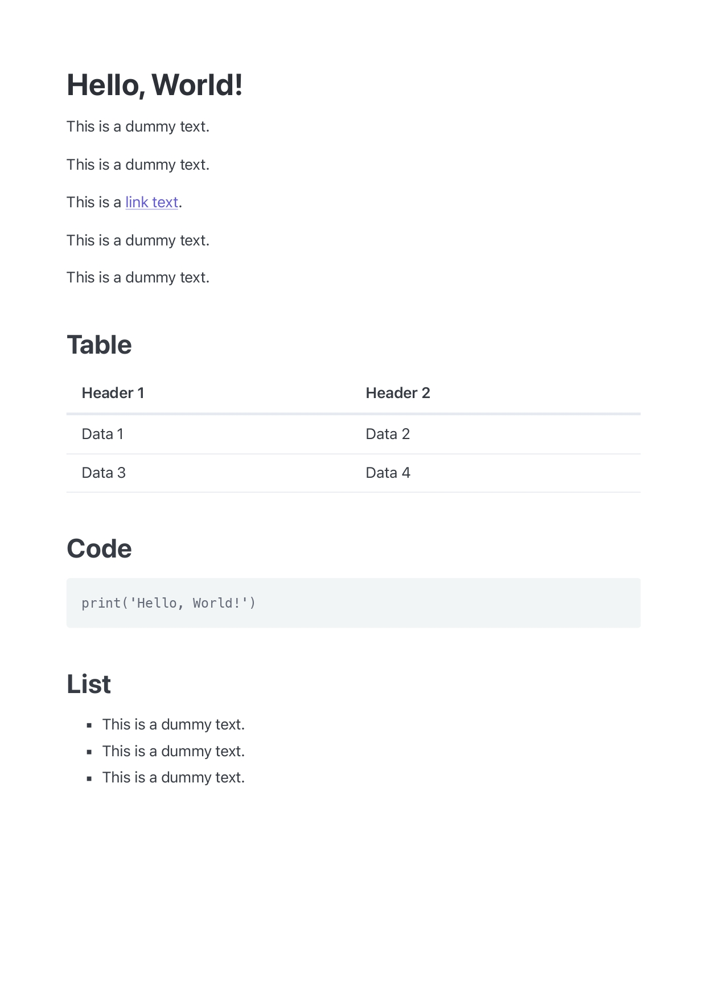

就活をしていると職務経歴書が必要になる場面に遭遇します。

簡単に職務経歴書を作れるWebサービスを利用するのも手ですが、自分の知的好奇心や技術力をアピールできるものを作りたいと思う方も多いのではないでしょうか？今回は、「ITエンジニアにやさしい職務経歴書」をテーマにマークダウンで職務経歴書を作る方法を解説していきます。

# 準備するもの

-   VSCode
-   [vscode-pdf](https://marketplace.visualstudio.com/items?itemName=tomoki1207.pdf)
-   pnpmなどのNode.jsのパッケージ管理システム
-   好きなCSSフレームワーク
    -   何を使ったらいいか分からない方にはClassless CSSフレームワークをおすすめします

# セットアップ

プロジェクトディレクトリを作ります。

```bash
mkdir ~/resume-example
cd ~/resume-example
```

Node.jsのプロジェクトを初期化します。

```bash
pnpm init
```

[md-to-pdf](https://github.com/simonhaenisch/md-to-pdf)をインストールします。

```bash
pnpm i -D md-to-pdf
```

職務経歴書として使うマークダウンファイルを作ります。

動作するかテストするために適当な文字列を書き込んでおきましょう。

```bash
echo '# Hello, World!' > resume.md
```

マークダウンファイルからpdfファイルを生成してみます。

```bash
pnpm md-to-pdf resume.md
```

例えば、resume.mdを引数として指定した場合はresume.pdfが生成されます。

VSCodeを開いてresume.pdfの内容を見てみましょう。

```bash
code .
```



md-to-pdfに渡したマークダウンファイルの内容に基づいて、pdfファイルが出力されることが分かります。

動作確認ができたら、md-to-pdfのコマンドをパッケージマネージャーにスクリプトとして登録しましょう。スクリプトを登録することで、pdfファイルを生成するためにコマンドを入力する時間を削減できます。

package.jsonを開いて、`"scripts"`ブロックを以下の内容に変更します。

```json
"scripts": {
  "make-resume": "pnpm md-to-pdf resume.md"
},
```

`make-resume`スクリプトを追加すると、以下のコマンドでpdfファイルを生成できるようになります。

```bash
pnpm make-resume
```

# スタイリング

## レイアウトを作る

md-to-pdfにはフロントマターで指定できるオプションが用意されています。

一例として、出力されるpdfファイルのレイアウトを設定する方法を示します。

resume.mdを以下のように変更します。

````markdown
---
pdf_options:
  format: A4
  margin: 20mm
---

# Hello, World!
This is a dummy text.

This is a dummy text.

This is a [link text](https://example.com/).

This is a dummy text.

This is a dummy text.

## Table
|  Header 1  | Header 2 |
|  ----  | ---- |
|  Data 1  | Data 2 |
|  Data 3  | Data 4 |

## Code

```
print('Hello, World!')
```

## List
- This is a dummy text.
- This is a dummy text.
- This is a dummy text.
````



上記の例では、A4のページに上下左右20mmの余白が設けられます。

オプションの詳細は[md-to-pdfのREADME](https://github.com/simonhaenisch/md-to-pdf/blob/master/readme.md)を参照してください。

## デザインを工夫する

今のままではデザインが味気ないですね。CSSフレームワークを使って見栄えを良くしましょう。

stylesheetオプションにCSSファイルのパスを指定することでCSSを読み込めます。

````markdown
---
pdf_options:
  format: A4
  margin: 20mm
stylesheet:
  - https://cdnjs.cloudflare.com/ajax/libs/picocss/2.0.6/pico.classless.indigo.min.css
---

# Hello, World!
This is a dummy text.

This is a dummy text.

This is a [link text](https://example.com/).

This is a dummy text.

This is a dummy text.

## Table
|  Header 1  | Header 2 |
|  ----  | ---- |
|  Data 1  | Data 2 |
|  Data 3  | Data 4 |

## Code

```
print('Hello, World!')
```

## List
- This is a dummy text.
- This is a dummy text.
- This is a dummy text.
````



モダンなデザインになりました。

# おわりに

[マークダウンで作る職務経歴書の例](https://github.com/nagutabby/resume)をGitHubで公開しています。参考までにどうぞ。
