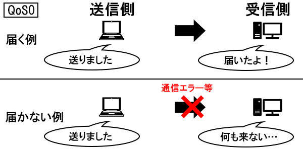
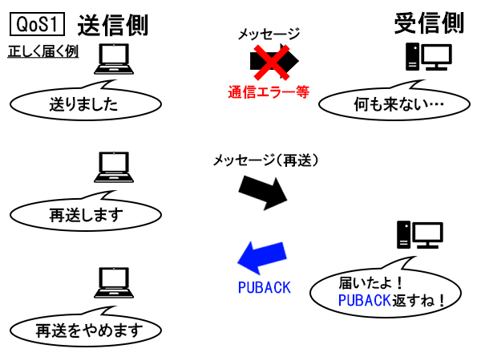
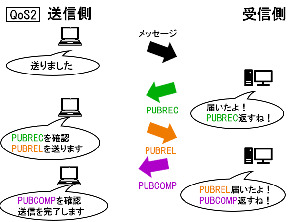
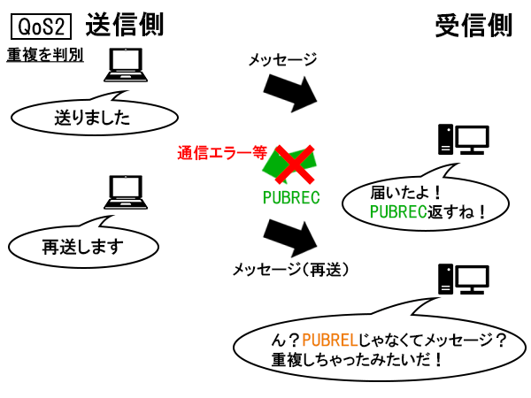

<h1 id="hf591bdc05d">MQTTとは</h1>
MQTTは、たくさんの端末同士で、短いメッセージを効率的に送受信するためのプロトコルです。複数のセンサーから送信されるデータを監視し、送信されたデータの値に応じて処理を実行できます。
<h1 id="hb125c30679">MQTTの歴史</h1>
1999年にIBMとEurotechが開発しました。当初は石油やガスの産業で使用することを想定しており、衛星経由で石油パイプラインをモニタリングするためには、帯域幅や消費電力を削減する必要があったため、それを達成するためのプロトコルとしてMQTTが生まれました。2010年には、IBMがMQTTをオープンプロトコルとして公開し、2013年にはOASISという標準化団体がMQTTの標準化を開始しました。
<h1 id="h362cb719ab">MQTTの特徴</h1><h2 id="h6c6cedf2b3">データが軽量</h2>
MQTTはパケットのヘッダーサイズが小さいため、HTTPなどの他のプロトコルを使用した場合と比べてデータ量、CPUの負荷、消費電力が小さくなります。そのため、特にIoTアプリケーションと相性が良く、IoTの分野で普及しています。
<h2 id="h9af62cc3cc">Pub/Sub(Publish-Subscribe)モデル</h2>
Pub/Subモデルは、たくさんの端末同士で、非同期にメッセージを送受信する仕組みです。送信されたメッセージは、トピックごとにブローカー(Broker)と呼ばれる中継システムに保管されます。メッセージの送信者はパブリッシャー(Publisher)と呼ばれ、メッセージの受信者はサブスクライバー(Subscriber)と呼ばれます。
<h3 id="h43bf9e6536">Pub/Subモデルの利点</h3>
Pub/Subモデルでは、サブスクライバーがトピックを後からサブスクライブしてメッセージを受信することもできるため、参加者の変化に強く、システムの規模の変更に対応しやすいという利点があります。
<h2 id="h94b87ef1ed">Retained messagesが使える</h2>
Retained messagesは、それぞれのトピックに対して最後に送信されたメッセージを、ブローカーに保持する機能です。この機能を使用するには、RetainedフラグをTrueに設定します。
<h2 id="hc704e3f5bc">QoSを設定できる</h2>
QoS(Quality of Service)は、通信の品質を制御する仕組みです。通信の品質が低すぎると適切に通信できず、高すぎると通信の無駄が多くなってしまいます。3種類の中から適切なQoSを設定することで通信の品質を制御します。
<h3 id="h506d321766">QoSで制御される通信</h3>
パブリッシャーとブローカーの間の通信と、ブローカーとサブスクライバーの間の通信がQoSによって制御されます。
<h3 id="hadc9fc4a21">QoS=0</h3>
受信側は、あるメッセージを最大で1回受信します。つまり、あるメッセージが受信されることもあれば、受信されないこともあります。通信エラーによってメッセージの受信に失敗した場合に、メッセージの再送は行われません。1番単純かつ軽量な通信方式です。

<figure></figure>
引用: <a href="https://sakiot.com/what-is-qos-of-mqtt/">https://sakiot.com/what-is-qos-of-mqtt/</a>

<h3 id="he10099a689">QoS=1</h3>
受信側は、あるメッセージを最低1回受信します。つまり、あるメッセージが1回だけ受信されることもあれば、重複して受信されることもあります。QoS=1ではメッセージの重複を排除できないため、もし重複していたとしても異なるメッセージとして扱われます。
<h4 id="h050eca76ef">メッセージの再送で重複が発生しない場合</h4><figure></figure>
引用: <a href="https://sakiot.com/what-is-qos-of-mqtt/">https://sakiot.com/what-is-qos-of-mqtt/</a>
<h4 id="h96e3f88dbc">メッセージの再送で重複が発生する場合</h4><figure></figure>
引用: <a href="https://sakiot.com/what-is-qos-of-mqtt/">https://sakiot.com/what-is-qos-of-mqtt/</a>
<h3 id="h301956d2c8">QoS=2</h3>
 受信側は、あるメッセージを1回だけ受信します。通信の品質が最も高い通信方法ですが、通信回数が多いため比較的低速です。
<h4 id="h11b0632d92">通信エラーが発生しない場合</h4><figure></figure>
引用: <a href="https://sakiot.com/what-is-qos-of-mqtt/">https://sakiot.com/what-is-qos-of-mqtt/</a>
<h4 id="hf70d3a8e13">通信エラーが発生する場合</h4><figure></figure>
引用: <a href="https://sakiot.com/what-is-qos-of-mqtt/">https://sakiot.com/what-is-qos-of-mqtt/</a>
<h1 id="h0e7ba14a88">MQTTを使った通信を試してみる</h1>
MQTTによる通信を行うためには、MQTTブローカーが必要です。主なMQTTブローカーとしては、Mosquitto, RabbitMQ, Apache ActiveMQがあります。今回はMosquittoをインストールします。
<pre><code>sudo apt install mosquitto mosquitto-clients</code></pre>
mosquitto.serviceが起動していることを確認します。起動していれば、activeと表示されます。
<pre><code>sudo systemctl is-active mosquitto</code></pre><h2 id="hffac67bbb5">helloトピックでメッセージを送受信</h2>
最初に、helloトピックに挨拶メッセージを送受信してみます。

まずはmosquitto_subコマンドでトピックをサブスクライブします。
<pre><code>mosquitto_sub -h localhost -t hello</code></pre>
次に、mosquitto_pubコマンドでメッセージをトピックにパブリッシュします。
<pre><code>mosquitto_pub -h localhost -t hello -m &quot;Hello, world!&quot;</code></pre><h2 id="hbfb23f2f99">Retained messagesを使う</h2>
MosquittoでRetained messagesを使うには、-rオプションを指定します。
<pre><code>mosquitto_pub --help
-r: message should be retained.</code></pre><pre><code>mosquitto_pub -h localhost -t hello -m &quot;This is a retained message&quot; -r</code></pre>
Retained messagesはブローカーに保持されているので、それをパブリッシュした後でトピックをサブスクライブしてもメッセージを受信できます。
<pre><code>nagutabby@debian:~$ mosquitto_sub -h localhost -t hello
This is a retained message</code></pre><h2 id="h74b7f38523">Retained messagesを削除する</h2>
Retained messagesを削除するには、空のRetained messagesを送信します。

<pre><code>mosquitto_pub --help
-n: send a null(zero length) message.</code></pre><pre><code>mosquitto_pub -h localhost -t hello -r -n</code></pre><h2 id="h0790765a35">トピックをまとめてサブスクライブする</h2>
#や+をサブスクライブ時に指定すると、トピックをまとめてサブスクライブできます。

まずはトピックとして、greeting/morningとgreeting/afternoonを作成します。
<pre><code>mosquitto_pub -h localhost -t greeting/morning -m &quot;Good morning!&quot; -r
mosquitto_pub -h localhost -t greeting/afternoon -m &quot;Hello!&quot; -r</code></pre>
次に、greetingという階層にあるトピックを#を使ってまとめてサブスクライブします。
<pre><code>mosquitto_sub -h localhost -t greeting/#
Good morning!
Hello!</code></pre><h2 id="h1da95cbe98">気象データを送受信する</h2><h3 id="h3ea6dbfe4f">OpenWeather</h3>
気象データを取得することができます。アカウント作成が必須です。

アカウント作成:

<a href="https://home.openweathermap.org/users/sign_up">https://home.openweathermap.org/users/sign_up</a>

APIキー:

<a href="https://home.openweathermap.org/api_keys">https://home.openweathermap.org/api_keys</a>

例えば、東京駅の気象データを取得するには、以下のコマンドを実行します。
<pre><code>curl &quot;https://api.openweathermap.org/data/2.5/onecall?lat=35.681236&amp;lon=139.767125&amp;units=metric&amp;lang=ja&amp;appid={YOUR API KEY}&quot;</code></pre><h3 id="hf5ff6582ce">Open-Meteo</h3>
こちらでも気象データを取得できます。アカウント作成が不要であるため、今回はこちらを使用します。

ドキュメント: <a href="https://open-meteo.com/en/docs">https://open-meteo.com/en/docs</a>

東京の1日の最高気温を直近1週間だけ取得してみます。
<pre><code>curl &quot;https://api.open-meteo.com/v1/forecast?latitude=35.6895&amp;longitude=139.6917&amp;daily=temperature_2m_max&amp;timezone=Asia%2FTokyo&quot;</code></pre>
データを確認しやすくするために、レスポンスをjqコマンドで整形します。
<pre><code>curl &quot;https://api.open-meteo.com/v1/forecast?latitude=35.6895&amp;longitude=139.6917&amp;daily=temperature_2m_max&amp;timezone=Asia%2FTokyo&quot; | jq</code></pre>
temperature_2m_maxの先頭の値を取り出し、パブリッシュするシェルスクリプトを書きます。
<pre><code>#!/bin/bash

temp=`curl &quot;https://api.open-meteo.com/v1/forecast?latitude=35.6895&amp;longitude=139.6917&amp;daily=temperature_2m_max&amp;timezone=Asia%2FTokyo&quot; | jq .daily | jq .temperature_2m_max | jq &quot;.[0]&quot;`
echo $temp
mosquitto_pub -h localhost -t weather/tokyo/temperature_2m_max -m $temp -r</code></pre>
pub_temp.shという名前で保存して実行します。そして、メッセージがパブリッシュされたトピックをサブスクライブします。
<pre><code>bash pub_temp.sh
mosquitto_sub -h localhost -t weather/tokyo/temperature_2m_max</code></pre>
