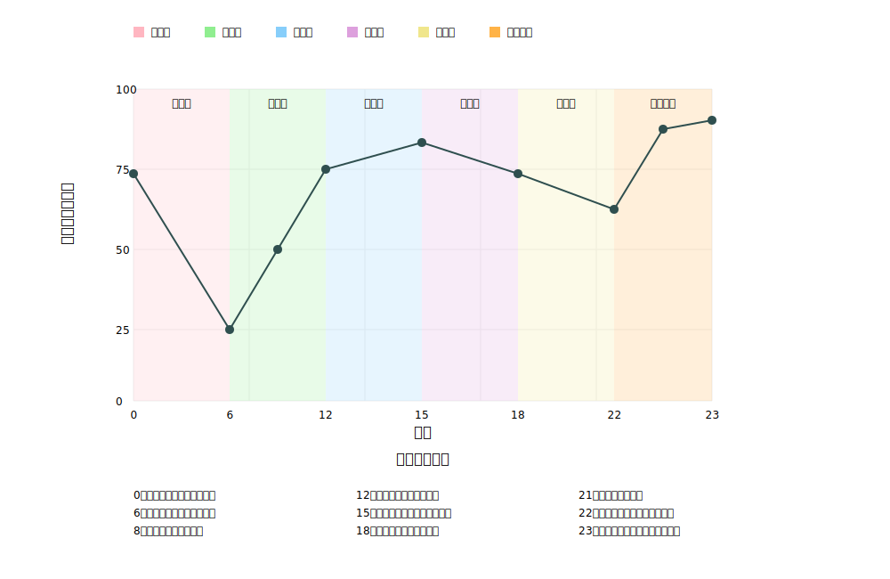

# 初めに

私がエンジニアを目指す理由は、人々が自分の意志で行動できる時間を増やしたいからです。

私はこれまでの人生を通じて、主体と客体の関係について考えてきました。まずは現在までの経験を整理します。

# 幼児期

## 経験

-   保育園では自由に遊べる時間があった
    -   保育園に入園した当初
        -   最初はどのように遊べばいいのか良く分からなかった
    -   しばらくして
        -   顔を出すうちに気軽に話せる友人ができたので、彼らのグループに加わり、砂遊びや木の実集めなどの自由度が高い遊びをして楽しんだ
    -   最終的に
        -   親密な友人を基点として、最終的にそれまで接点がなかった人とも関係を築いた

## 価値観

-   自由な創造性を重視するようになった
    -   砂遊びや木の実集めで自由に想像を膨らませる経験を積んだから
    -   友人と一緒に考えて新しい遊び方を見つけることの楽しさを知ったから

## 人間関係

-   最初は1人の仲の良い友人との関係から始まった
-   その友人を通じて新しい友人の輪が広がっていった
-   遊びを通じて、異なるグループの子どもたちとも自然に交流するようになった

## 私のモチベーションを高める要素

-   自主性が認められる環境
    -   自分でやり方を工夫できる
    -   試行錯誤が許される
    -   独自のアプローチが評価される
-   段階的な挑戦
    -   小さな成功体験の積み重ね
    -   無理のないペースでの成長
    -   安全な基盤からの挑戦
-   共同で取り組む創造的な活動
    -   対等な立場での意見交換
    -   意見交換によるアイデアの質の向上
    -   多様な視点の受容

# 小学時代

## 経験

### いじめ被害

-   それまでは無かった上下関係ができた
-   2年間に渡って上級生からいじめを受けた
-   教員や家族に相談したが、教員からは真面目に受け止めてもらえず、家族から学校への相談も根本的な問題解決にはならなかった
    -   教員: 「加害者は成績が優秀だからいじめをするはずがない」
-   最終的には、加害者を避けて行動することで被害をできるだけ抑えた
    -   彼らに餌を与えないことで問題の収束を図った
-   一部の人間関係には苦労したが、友人や同級生との関係は良好だった
    -   傷を癒やしてくれる場を確保してストレスに対処した

### 学校に馴染めない友人への心理的な支援

-   中級生から上級生までの間、学校に馴染めず授業にほとんど出席しない生徒がいた
-   彼は家庭環境が悪く、そのせいで人間関係の構築に苦労していた
-   ビデオゲームを通じて彼と親しくなり、その後は放課後に、私の友人と一緒にゲームで遊ぶ仲になった
-   彼の家庭環境を改善することはできなかったが、彼にもう1つの居場所を与えることで成長を手助けできた

## 価値観

### いじめ被害

-   集団同調への疑問を持つようになった
    -   「皆がやっているから」という理由で加害に加わる上級生がいたから
    -   いじめの傍観者が多数いることに違和感を覚えたから
    -   「成績が良いから正しい」という教員の判断基準に疑問を感じたから
-   正義感が芽生えた
    -   理不尽な暴力を受けたから
    -   教員が表面的な評価で人を判断する様子を見たから

### 学校に馴染めない友人への心理的な支援

-   居場所作りの重要性に気付いた
    -   学校以外の交流の場が果たす役割を知った
    -   形式的でない関係性の価値を理解した
-   共通の興味を通じて相手への理解を深めた
    -   ゲームという共通言語を見つけた
    -   興味を通じて自然な関係を構築した
    -   非言語的なコミュニケーションの価値を理解した

## 人間関係

### いじめ被害

-   いじめの加害者との関係
    -   上級生による2年間の継続的な暴力を受けた
    -   加害者の行動パターンを基に、接触を最小限に抑える戦略を取った
-   教員との関係
    -   相談しても取り合ってもらえなかった
    -   表面的な評価で判断する大人に不信感を抱いた
-   家族との関係
    -   相談したが根本的な解決には至らなかった
    -   家族の支援には限界があることを理解した
    -   それでも精神的な支えとしては重要な存在であった
-   同級生との関係
    -   信頼できる友人との絆を維持した
    -   いじめに加わらない中立的な立場の同級生と親しい関係を築いた

### 学校に馴染めない友人への心理的な支援

-   橋渡し的な関係の構築
    -   一対一の関係から友人グループへの統合を図った
    -   相手のペースを尊重した関係作りを行った
-   互いの状況を理解し合える関係の構築
    -   相手の困難を受け入れた
    -   押し付けがましくない支援を行った

## 私のモチベーションを高める要素

### いじめ被害

-   自律的な問題解決
    -   自力で解決策を見出す
    -   状況を客観的に分析する能力を身に付ける
    -   実行可能な対策を考えて実施する
-   公正さの追求
    -   不当な権力の行使への対抗
    -   理不尽な状況を改善したい意欲
    -   社会正義への関心
-   本質的な人間関係の重視
    -   表面的な評価に囚われない
    -   真の相互理解を重視
    -   信頼できる関係の構築

### 学校に馴染めない友人への心理的な支援

-   間接的な支援
    -   直接的な介入を避けた支援を行う
    -   環境作りを通じた間接的な援助を行う
    -   相手の自主性を尊重する

# 中学時代

## 経験

-   放課後に様々な課外活動に参加できるようになった
-   人間関係の構築のために課外活動に参加したいと考えた
-   小学生時代から水泳に取り組んでいたので、中学生時代は本格的に水泳に取り組むことにした
-   週3から4回、1回あたり2時間かけて水泳を練習し、その結果、県大会に出場できた

## 価値観

-   継続的な努力の価値への理解
    -   練習の積み重ねが結果につながることを実感
    -   具体的な目標設定の重要性に気付いた
    -   自分の成長を数値で実感できることに意義があると思った
-   自己管理の重要性の認識
    -   目標達成のために計画的に行動することが重要であると感じた
    -   物事を自己責任で判断して実行する必要性を理解した

## 人間関係

-   競争と協力の両立
    -   個人競技でありながら、チームとしての一体感を作ることができた
    -   目標を共有できるチームメンバーとの絆を深めた
-   実力主義的な関係性の構築
    -   努力と結果が明確に結びつく環境で活動した
    -   客観的な基準で自分を評価した
    -   互いの成長を認め合える関係を作った

## 私のモチベーションを高める要素

-   明確な目標設定と達成指標
    -   県大会出場という具体的な目標を立てた
    -   タイムという客観的な指標に基づいて行動した
-   努力と成果の相関関係
    -   練習量と記録の関係が明確である
    -   成長過程が可視化できる
    -   結果が数値として現れる

# 高校時代

## 経験

-   大学受験に向けた計画を立てていた
-   私が将来何をやりたいのか良く分からなかった
-   その中で、2人の尊敬する教員に出会った
    -   現代文の教員
        -   当時の教育制度に疑問を持ち、より良い教育について考えていた
        -   担当科目に責任を持つだけでなく、進路についての相談にも乗っていた
    -   古典の教員
        -   古典文学が好きで、作品が書かれた背景まで丁寧に説明していたのが印象的だった
        -   自分の興味を成果に結びつけていて理想的な姿だと思った
-   自分の興味について考えたときに、常に電子機器が身の回りにあったことに気付いた
    -   情報工学を専攻しようと決めた

## 価値観

-   自己実現の具体的なモデルへの気付き
    -   教員たちの生き方から、理想の働き方を学んだ
    -   興味と職業を結びつけることで自分の可能性を見つけられると考えた
    -   既存の制度に疑問を持つ姿勢が重要であると感じた
-   専門性と視野の広さの両立
    -   自分が担当する分野での深い知識を身に付ける
    -   周辺領域への関心と理解を深める
    -   仕事を通じた社会貢献の可能性を探る

## 人間関係

-   メンター的存在との出会い
    -   教員との建設的な対話
    -   進路相談を通じた信頼関係の構築
    -   ロールモデルとして人生の支えになった

## 私のモチベーションを高める要素

-   理想像の具体化
    -   実在する人物をモデルとすることで具体的な将来像を描ける
    -   現実的な目標設定ができる
-   批判的思考と建設的な姿勢の両立
    -   現状への問題意識を持つ
    -   改善策を模索する
    -   より良い方向に向かうことを目指す

# 大学時代

## 経験

### 課外活動でのアプリケーション開発

-   コロナ禍で学生同士が交流する機会が限られていた
-   共通目標を達成するために活動することで、継続的に学習できる環境を整える必要があった
-   大学1年生の頃から課外活動に参加し、他の学生とチームを組んでアプリケーションの受託開発に取り組んだ
-   複数のプロジェクトに取り組み、それぞれで成果を挙げた
    -   サーバーのコロケーションサービスからPaaSへの移行
    -   学内のアンケート収集サービス「SAKITO」での引換券の利用手順の改善と収益化

### 大学院進学のための受験勉強

-   大学3年生の秋から将来の進路について悩むようになった
-   同じ大学にいる人の8割が就活を始め、残りのほとんどが内部進学制度を利用して将来の進路を確定させていた
-   今の大学での活動には満足していたが、課外活動や研究生活に慣れてきたことで物足りなさも感じていた
-   そこで、外部進学をすることに決め、半年間に渡ってリサーチプロポーザルを作成したり語学学習をしたりして対策した
-   無事大学院に進学できたが、場当たり的な自分の生き方を反省し、人生の目的について考えるきっかけになった

## 価値観

### 課外活動でのアプリケーション開発

-   チームで価値を生み出すことの重視
    -   個人の技術力だけでなくチームとしての成果も重視
    -   共通目標を達成するための活動に意義があると考えた
    -   技術を通じた具体的な課題解決の価値を理解した
-   実践的な成長機会の追求
    -   コロナ禍という制約下で、自己実現に向けて様々なことに挑戦した
    -   実務経験を通じてシステム開発について学んだ
    -   理論と実践の結びつきを重視した

### 大学院進学のための受験勉強

-   独自路線の選択
    -   多数派であった就職でも内部進学でもない道を選択した
    -   安易な同調を避ける姿勢を身に付けた
    -   自分なりの成長機会を追求するようになった
-   挑戦と内省の両立
    -   現状に満足しながらも向上心を維持した
    -   長期的な視点での自己実現について考えた
    -   人生の目的を問い直す姿勢を身に付けた

## 人間関係

### 課外活動でのアプリケーション開発

-   同じ目的を達成するために活動するチームの形成
    -   プロジェクトを通じて関係を構築した
    -   学業とのバランスを取れるようにするために、OJTでの研修の仕組みを改善した
-   顧客との関係の構築
    -   顧客との対話を重視し、進捗報告や開発計画策定のためのミーティングを増やした
    -   大きな機能をリリースする前に受け入れテストを実施し、必ずフィードバックをもらうようにした

### 大学院進学のための受験勉強

-   周囲との差別化
    -   多数派と異なる選択をした
    -   周囲の動向に流されない態度を習得した
-   新しい環境に適応する準備
    -   新しい人間関係を構築する覚悟を持った
    -   コンフォートゾーンを出る決断をした

## 私のモチベーションを高める要素

### 課外活動でのアプリケーション開発

-   実践的な課題解決
    -   実際に人々から利用されるサービスの改善
    -   具体的な成果の可視化
    -   ユーザーからのフィードバック
-   技術的な挑戦
    -   新しい技術への挑戦
    -   実務レベルの技術習得
-   ビジネス価値の創出
    -   サービスの収益化
    -   ユーザー体験の向上

### 大学院進学のための受験勉強

-   自己決定による挑戦
    -   主体的な進路選択
    -   独自の目標設定
    -   コンフォートゾーンからの脱却
-   自己理解
    -   自分の生き方についての反省
    -   人生の目的の模索
    -   長期的なビジョンの構築

# 大学院時代

## 経験

-   講義や研究を通じて、「私はどう思うのか？」「それはどうしてなのか？」といった考え方を要求される場面が増えた
-   特に、私が研究対象としているソフトウェア設計においては、絶対的な正解がないため判断の基準をあらかじめ決めておくことが重要になる
-   現在は、システムを複合的なものとして捉えることで、全体像を理解しようとしている
-   このように捉えることで、システムを人の領域とソフトウェアの領域に分離できるのではないかと考えている

## 価値観

-   主体的な思考の重視
    -   自分なりの考えを持つことの大切さに気付いた
    -   判断基準を明確にすることで思考が整理されると考えた
-   対象の複雑さを全体として理解する
    -   人とソフトウェアの関係によってシステムが作られると考えた
    -   構成要素間の相互作用に着目するようになった

## 人間関係

-   専門的な対話のための関係構築
    -   研究を通じて指導教員と議論するようになった
    -   プロジェクト型の講義を通じて学生と意見交換するようになった
-   地域社会との関係構築
    -   技術コミュニティーが主催する勉強会で経験豊富なエンジニアと話し合うことで有意義な議論ができる関係性を築いた

## 私のモチベーションを高める要素

-   知的探求
    -   正解のない問題への挑戦
    -   新しい視点の発見
-   実践的な応用
    -   理論の実用性を考える
    -   現実問題への適用方法を考える
    -   人とシステムを調和させるために必要なことを考える

# 私がエンジニアを目指す理由

私がエンジニアを目指す根本的な理由は、人々が自分の意志で行動できる時間を増やしたいという願いにあります。この動機は、私の人生経験を通じて形作られてきました。

幼児期には、自由な創造性と主体性が尊重される環境で育ち、その価値を深く理解しました。一方で、小学生時代のいじめ被害の経験からは、不当な権力構造や形式的な評価への疑問を持ち、本質的な問題解決の必要性を認識しました。

中学時代には、水泳での経験を通じて継続的な努力と具体的な目標設定の価値を学び、高校時代には、理想的な教員との出会いから、専門性を活かした社会貢献の可能性を見出しました。

大学時代には、アプリケーション開発を通じて技術で具体的な課題を解決する喜びを知り、大学院での研究では人とソフトウェアの関係性について深く考察する機会を得ました。

これらの経験から、私は技術を通じて人々の自由と主体性を支援し、社会の不合理な制約を取り除くことを目指しています。エンジニアという職業は、私の価値観と能力を活かしながら、人々が本来の可能性を発揮できる環境を作るための道具であると考えています。

特に、システムを人の領域とソフトウェアの領域に適切に分離し、両者の調和を図ることで、技術が人々の自由を阻害するのではなく、むしろ促進する役割を果たすことができると考えています。

# モチベーショングラフ

